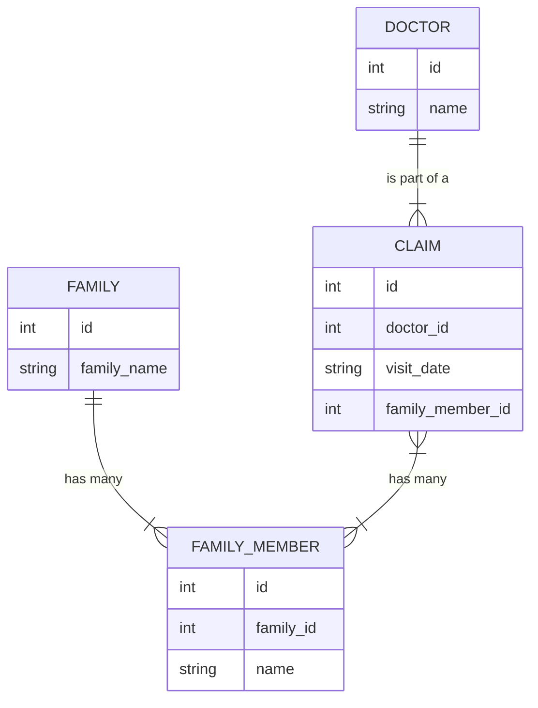

# Data model

```mermaid
erDiagram
    FAMILY ||--|{ FAMILY_MEMBER : "has many"
    DOCTOR ||--|{ CLAIM : "is part of a"
    CLAIM }|--|{ FAMILY_MEMBER : "has many"
    FAMILY {
        int id
        string family_name
    }
    FAMILY_MEMBER {
        int id 
        int family_id
        string name
    }
    DOCTOR {
        int id
        string name
    }
    CLAIM {
        int id
        int doctor_id
        string visit_date
        int family_member_id
    }
```